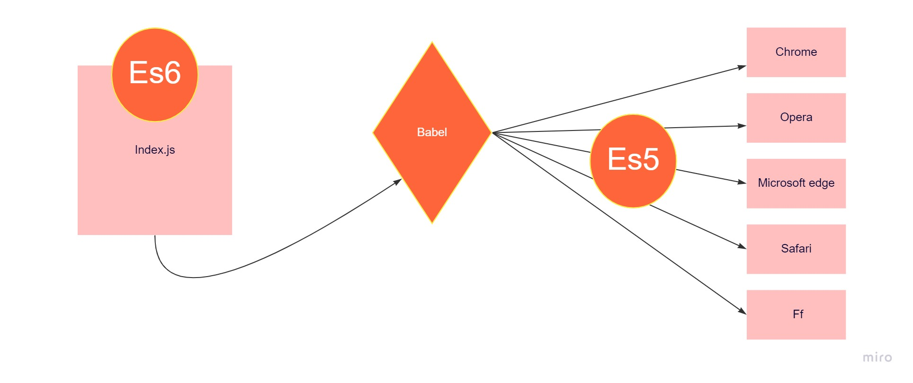
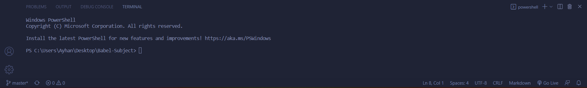
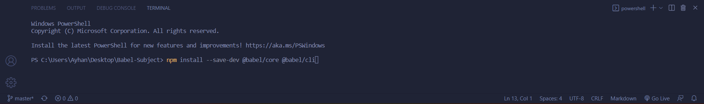
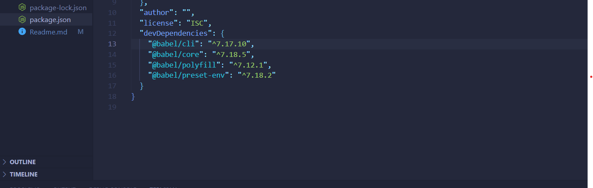
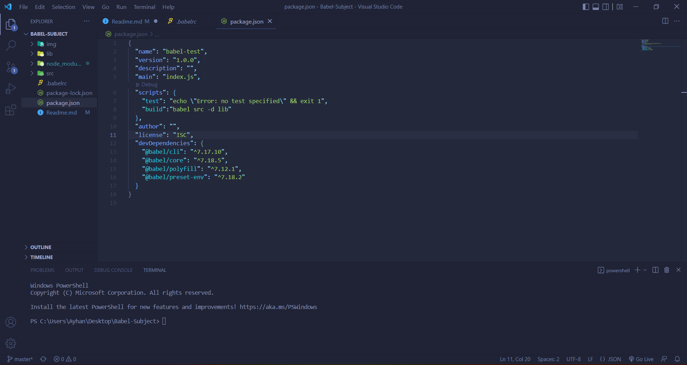
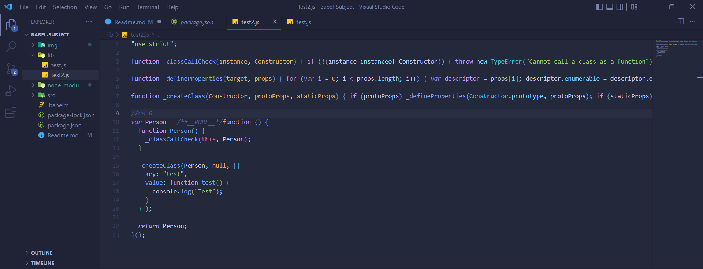

### Babeljs-Subject



#### Hello, my name is ayhan, I will try to explain babeljs to you in this article. After Javascript came in 2015 with es6 and later updates and changes, several browsers did not support it. And es6 and later js syntax functions stopped working. Its purpose is to enable es6 and later javascript features to run in all browsers. The working principle is to convert javascript files written with es6 and later features such as translation to es5 format and make them work in browsers.

### Procces

Open Terminal



#### First I assume package.json is installed and first write this syntax in terminal and install babeljs under node_modules file

```js
npm install --save-dev @babel/core @babel/cli
```



#### After babel js download is finished, package_json is displayed as



#### After downloading, you can create a new .babelrc file and write codes in it.

```js
{
    "presets": ["@babel/preset-env"]
}
```

#### Afterwards, come package json and create a build inside the object named scripts.add "babel src -d lib "



#### npm run build and the result should be.




#### Your js files converted to es5 format are in the lib folder.