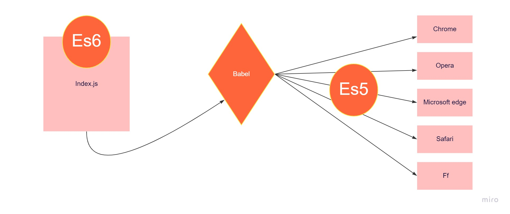

### Babeljs-Subject

#### Hello, my name is ayhan, I will try to explain babeljs to you in this article. After Javascript came in 2015 with es6 and later updates and changes, several browsers did not support it. And es6 and later js syntax functions stopped working. Its purpose is to enable es6 and later javascript features to run in all browsers. The working principle is to convert javascript files written with es6 and later features such as translation to es5 format and make them work in browsers.

